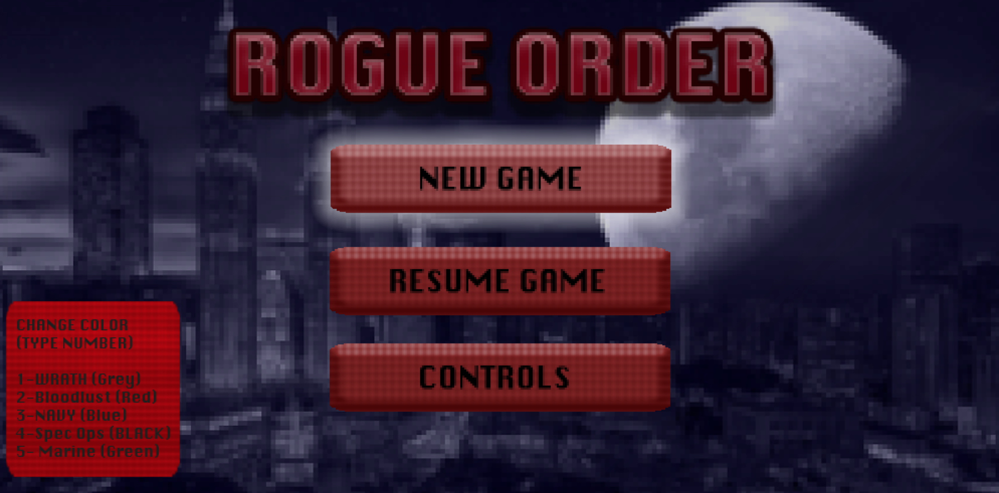
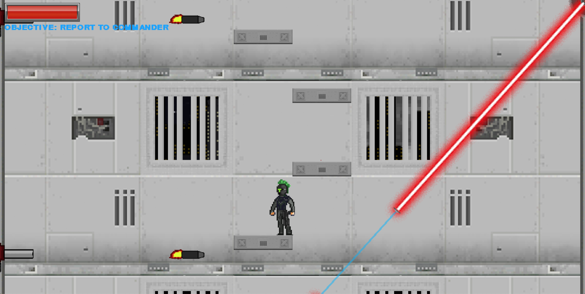
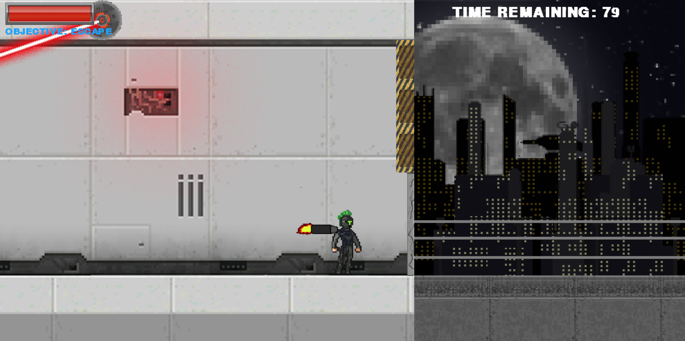
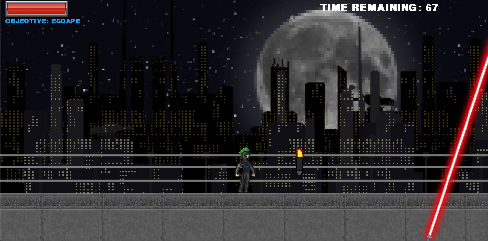
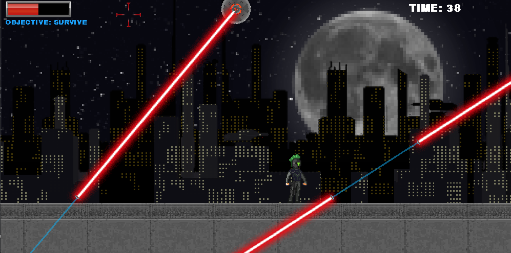

# A Sci-fi platformer video game

## Contents
1. [Overview](#Overview)
2. [Architecture](#Overview)
3. [Guide](#guide)
4. [Screenshots](#screenshots)
5. [Database Diagrams](#Database-Diagrams)

## Overview
*The year is 2318. The United Republic of Humanity (URH) has been in power for three centuries, ever since a mysterous being took over. Now confined to the shadows of his throne, Earth has become prosperous and has bathed in technology from across the stars. But secretly, every day the URH's grasp grows stronger. The citizens of Earth have grown fearful of the URH's power... and of him.*

*But from the light rises hope for the planet. The insurection has won countless victories against the URH, putting the lives of millions at stake. It is time for their hope to dissapear.*

*It is your task, WRATH TEAM to defeat the insurection. Failure to do so will result in your termination. This is your ORDER.*

This game was developed for a class at Carleton University, COMP 1405 which is an introductory video game course. As a result, this game is pretty short, with only 3 levels. However, each level is unique in obstacles and design. 

## Architecture

The game itself was developed in Python 3, by implementing the Pygame library to manage game assets and windows. 

## Guide

To install and play the game, you are require to have both Python 3 and Pygame installed. After this, simply run the following in the command line to play:

`python3 main,py`

## Screenshots

### Main Menu

### Level 1

### Level 2

### Level 3

